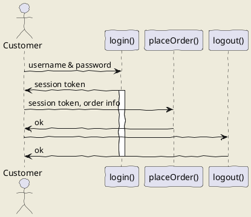

# BudgetFreak

| Build | Code Quality |
|---|---|
| |  |
 
## Code Quality

* Builds on CircleCI
* Linting by sonarcloud: https://sonarcloud.io/organizations/budgetfreak-github/projects

## How to contribute

See our [contribution guide](https://github.com/BudgetFreak/BudgetFreak/blob/master/.github/CONTRIBUTING.md).

